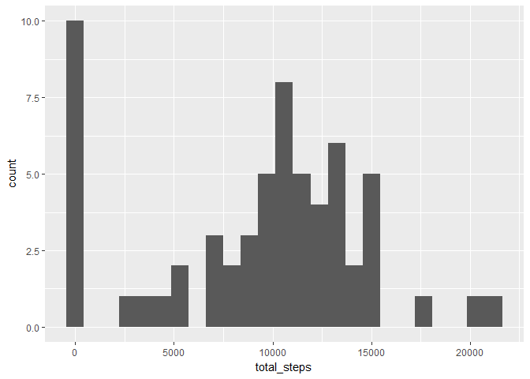

# Reproducible Research: Peer Assessment 1
Francis McGuire  


## Loading and preprocessing the data
First we load a few libraries we will need during this analysis

```r
library(dplyr)
library(ggplot2)
```

We now need to unzip and load the activity data

```r
unzip("activity.zip")
activity <- read.csv("activity.csv")
```


## What is mean total number of steps taken per day?

First we create an aggregation of total steps for day

```r
sumStepsByDay <- activity %>%
                  group_by(date) %>%
                  summarise(total_steps = sum(steps, na.rm=TRUE))
```

Now we create a histogram of the data

```r
ggplot(sumStepsByDay, aes(x=total_steps), binwidth = ) + geom_histogram(bins= 25)
```

<!-- -->

Finally we get the mean and median values

```r
meanSteps   <- mean(sumStepsByDay$total_steps)
medianSteps <- median(sumStepsByDay$total_steps)
```

The mean total steps is ``9354.2295082`` and the median is ``10395``

## What is the average daily activity pattern?

The first step is to get the average number of steps by 5-min interval

```r
averageStepsByInterval <- activity %>%
                            group_by(interval) %>%
                            summarise(average_steps = mean(steps, na.rm=TRUE))
```

We now draw a line chart, plotting the 5-min interval as a time series(X-axis) and the average daily steps as the Y-axis

```r
ggplot(averageStepsByInterval, aes(x= interval, y= average_steps)) +
      geom_line() +
      ggtitle("Average Daily Steps by 5-min Interval") +
      xlab("5 Min Interval") +
      ylab("Average Steps")
```

<!-- -->

Finally With get the Max interval in the time series

```r
maxIntervalRow <- which.max(averageStepsByInterval$average_steps)
maxInterval    <- averageStepsByInterval[maxIntervalRow, "interval"]
maxIntervalVal <- averageStepsByInterval[maxIntervalRow, "average_steps"]
```
The interval with the maximum average number of steps is ``835`` with a value of ``206.1698113``

## Imputing missing values
We count ther number of NA values

```r
numNAValues <- sum(is.na(activity$steps))
```

The number of NA values in the activity data set is ``2304``
.
Next, we implement a strategy to replace interval with NA values with the average daily steps for that interval. With this we create an ehanced version of the activty dataset.

```r
activityNaFixed <- activity
for(i in 1:nrow(activityNaFixed)) {
  if(is.na(activityNaFixed[i, "steps"]) == TRUE) {
    
    currentInterval <- activityNaFixed[i, "interval"]
    replaceValue    <- averageStepsByInterval[averageStepsByInterval$interval == currentInterval, "average_steps"]
    
    activityNaFixed[i, "steps"] <- replaceValue
  }
}
```

Next we recreate a histogram with the total number of steps using our enhanced dataset

```r
sumStepsByDayNaFixed <- activityNaFixed %>%
                          group_by(date) %>%
                          summarise(total_steps = sum(steps, na.rm=TRUE))

ggplot(sumStepsByDayNaFixed, aes(x=total_steps), binwidth = ) + geom_histogram(bins= 25)
```

<!-- -->

The final step is to recalculate the mean and median values for the enhanced version of the steps by day dataset

```r
meanStepsNaFixed   <- format(mean(sumStepsByDayNaFixed$total_steps), scientific = FALSE)
medianStepsNaFixed <- format(median(sumStepsByDayNaFixed$total_steps), scientific = FALSE)
```

The mean total steps is ``10766.19`` and the median is ``10766.19``

## Are there differences in activity patterns between weekdays and weekends?
First we create a new factor variable in our data set, indicating if the day is a weekday or a weekend

```r
activityNaFixed$date <- as.Date(activityNaFixed$date)
weekendDays          <- c('Saturday', 'Sunday')

weekDayType <- sapply(weekdays(activityNaFixed$date), function(x) ifelse(x %in% weekendDays, "weekend", "weekday"))
weekDayType <- factor(weekDayType)

activityNaFixed$weekDayType <- weekDayType
```

We then calculate the average steps by time interval and week day type

```r
averageStepsByIntervalAndWeekDayType <- activityNaFixed %>%
                                          group_by(interval, weekDayType) %>%
                                          summarise(average_steps = mean(steps, na.rm=TRUE))
```

We finaly create a line chart with 2 panels show the average steps by interval for weekdays and weekendsW

```r
ggplot(averageStepsByIntervalAndWeekDayType, aes(x= interval, y= average_steps)) +
        geom_line() +
        ggtitle("Average Daily Steps by 5-min Interval") +
        xlab("5 Min Interval") + ylab("Average Steps") +
        facet_wrap( ~ weekDayType, nrow = 2)
```

<!-- -->
